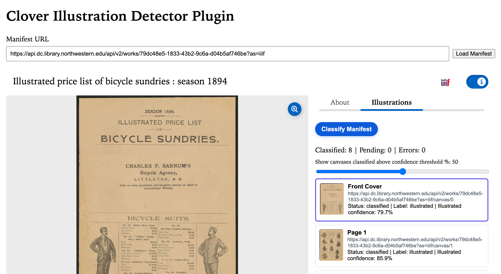

# Clover Illustration Detector Plugin

A plugin for [`@samvera/clover-iiif`](https://www.npmjs.com/package/@samvera/clover-iiif) that adds an Information Panel tab to classify IIIF canvases as `illustrated` or `not-illustrated` using a lightweight Hugging Face image classification model.

## Install

In a Clover host app, install both Clover and this plugin:

```bash
npm install @samvera/clover-iiif@latest @nulib/clover-illustration-detector-plugin
```

`@samvera/clover-iiif` is declared as a peer dependency (`>=3.3.8 <5`) so the host app controls the Clover version while satisfying plugin compatibility.

## How To Use In A Clover App

Register the plugin with your existing Clover viewer.

```tsx
import Viewer from "@samvera/clover-iiif/viewer";
import { createIllustrationDetectorPlugin } from "@nulib/clover-illustration-detector-plugin";

const plugins = [
  createIllustrationDetectorPlugin({
    id: "illustration-detector",
    tabLabel: "Illustrations",
  }),
];

export function ManifestViewer({ manifestUrl }: { manifestUrl: string }) {
  return (
    <Viewer
      iiifContent={manifestUrl}
      plugins={plugins}
      options={{
        informationPanel: { open: true },
      }}
    />
  );
}
```

Plugin options:

- `id` (optional): custom plugin id. Default: `illustration-detector`.
- `tabLabel` (optional): Information Panel tab label. Default: `Illustrations`.

## Screenshot



## Features

- Adds an Information Panel tab (`Illustrations` by default)
- Classifies every canvas in the active manifest
- Shows status, predicted label, and illustrated confidence per canvas
- Supports confidence threshold filtering in the panel UI
- Lets users click a result to navigate to that canvas

## Development

```bash
npm install
```

Run local dev viewer (Vite, port `3003`):

```bash
npm run dev
```

Build distributable output (`dist/`, ESM + CJS + types):

```bash
npm run build
```

Watch library build:

```bash
npm run watch
```

Type-check:

```bash
npm run typecheck
```

## Test App (Temporary)

This repo includes a disposable integration app in `/test-app` for real-world verification against the published package.

```bash
cd test-app
npm install
npm run dev
```

Delete `/test-app` after verification and documentation are complete.

## Publish

```bash
npm publish
```

The `prepublishOnly` script runs `typecheck` and `build` before publishing.

## Notes

- The classifier model is loaded from Hugging Face:  
  `small-models-for-glam/historical-illustration-detector`
- Classification runs client-side and processes canvases concurrently.
- Canvases without an image body/thumbnail are marked as skipped.
